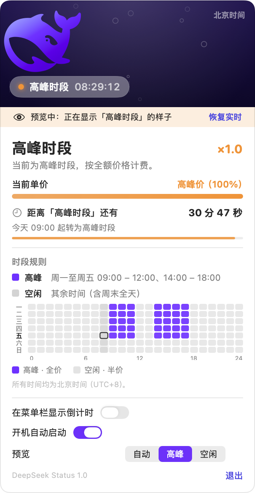
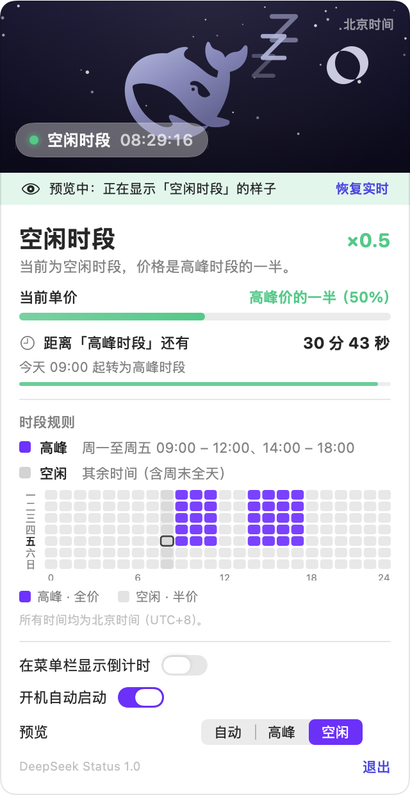
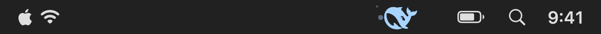
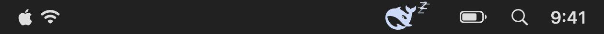
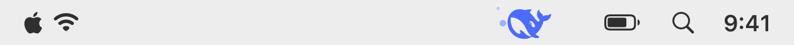
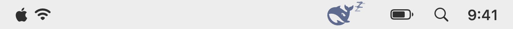

<div align="center">

# 🐳 DeepSeek Status

**A tiny macOS menu bar app that tells you — at a glance — whether DeepSeek is in peak or off-peak pricing.**


[](#requirements)
[](https://swift.org)
[](LICENSE)
[](#privacy)

</div>

Idle (off-peak) pricing is half the peak price, so "are we in peak hours right now?" is a question
worth answering without opening a browser tab. DeepSeek Status answers it with a whale.

- 🔵 **Peak hours** — a bright DeepSeek-blue whale, head up, bubbles trailing behind its tail.
- 😴 **Off-peak hours** — a pale, sleepy whale lying on its side, with little `z`s floating above it.

Click the whale to open a panel with the current period, the price multiplier, a live countdown to
the next switch, and a weekly schedule heat map. Optionally it can also show the countdown directly
next to the menu bar icon.

---

## Screenshots

| Peak hours (`×1.0`) | Off-peak hours (`×0.5`) |
| :---: | :---: |
|  |  |
| *Captured live; the banner is the preview mode being on.* | *Captured live during off-peak hours.* |

Menu bar in both states and on different menu bar backgrounds:

| | Peak | Off-peak |
| :--- | :---: | :---: |
| **Dark menu bar** |  |  |
| **Translucent / light menu bar** |  |  |

---

## Pricing rule

> Off-peak pricing is half of peak pricing.
> Peak hours are **Monday–Friday 09:00–12:00 and 14:00–18:00, Beijing time**. Everything else is off-peak.

| Time (Beijing) | Period | Price |
| --- | --- | --- |
| Mon–Fri 09:00–12:00 | Peak | 100% |
| Mon–Fri 12:00–14:00 | Off-peak | 50% |
| Mon–Fri 14:00–18:00 | Peak | 100% |
| Mon–Fri 18:00–09:00 (next day) | Off-peak | 50% |
| Saturday and Sunday, all day | Off-peak | 50% |

Details:

- Ranges are **half-open**: 12:00 sharp is already off-peak, 18:00 sharp is already off-peak,
  and 09:00 sharp is already peak.
- The decision is **always made in Beijing time** (`Asia/Shanghai`, UTC+8, no daylight saving),
  regardless of your Mac's time zone. If your Mac is in a different time zone, the panel says so.
- Only the weekday and the time of day are used. Chinese public holidays are **not** part of the rule.

---

## Requirements

- macOS **14.0 (Sonoma)** or later.
- Apple Silicon or Intel. The app is developed and tested on Apple Silicon (arm64); there is no
  architecture-specific code.

---

## Installation

### Build from source

Requires **Xcode 16 or later** — the project uses the file-system-synchronized group format
(`objectVersion = 77`). The Command Line Tools alone are enough for `Tools/build.sh`.
Developed with Xcode 27; the deployment target is macOS 14.0.

```bash
git clone <this repository>
cd DeepSeekStatus

./Tools/build.sh run     # build (Debug) and launch
```

Other options:

```bash
./Tools/build.sh          # Debug build only
./Tools/build.sh release  # Release build
```

The product lands in `Build/DerivedData/Build/Products/<configuration>/DeepSeekStatus.app`.

Or just open `DeepSeekStatus.xcodeproj` in Xcode, select the `DeepSeekStatus` scheme and press ⌘R.

### Prebuilt app

1. Download `DeepSeekStatus.zip` from the **Releases** page of this repository.
2. Unzip it and drag `DeepSeekStatus.app` into `/Applications`.
3. The app is signed ad-hoc and is **not notarized**, so the first launch is blocked by Gatekeeper.
   Either right-click the app → **Open** → **Open**, or clear the quarantine flag once:

   ```bash
   xattr -dr com.apple.quarantine /Applications/DeepSeekStatus.app
   ```

Either way the app has **no Dock icon** — look for the whale in the menu bar, right of the
menu bar extras.

---

## Usage

| Action | What happens |
| --- | --- |
| **Left-click** the whale | Open / close the details panel |
| **Right-click** the whale | Quick menu: preview peak, preview off-peak, follow live time, show countdown in the menu bar, quit |
| **Preview** picker in the panel | Force the app to *display* peak or off-peak so you can see both looks at any time. It only changes what is drawn, never the real pricing |
| **Show countdown in the menu bar** | Adds an `HH:MM:SS` countdown next to the whale (off by default) |
| **Launch at login** | Registers the app as a login item via `SMAppService` (off by default) |
| **Quit** | Quits the app |

The panel contains:

- the current period and its price multiplier (`×1.0` / `×0.5`);
- a "current unit price" comparison bar;
- the countdown to the next switch, plus how far through the current block you are;
- a 7×24 weekly heat map — blue = peak, gray = off-peak, with the current hour outlined;
- the two toggles above and a preview picker.

The panel closes when you click anywhere outside it, press <kbd>Esc</kbd>, or click the whale again.

---

## Privacy

The app never touches the network. There is no analytics, no update check, no API key, no account.
It reads your system clock, draws a whale, and that's it. The only system state it writes is the
optional login item registration.

---

## FAQ

**Does it call the DeepSeek API or need an API key?**
No. It is a calendar, not a client. It only reads the local clock.

**Which time zone is used?**
Beijing time (`Asia/Shanghai`, UTC+8, no DST) always, no matter where your Mac is. This is
deliberate: the pricing schedule is defined in Beijing time.

**Are Chinese public holidays handled?**
No. The rule is weekday + time of day only.

**Why is the menu bar whale not animated?**
On purpose. `NSStatusItem` continuously re-snapshots any custom view placed in it, which costs
20–30% CPU even with no animation at all. A static bitmap drawn once into `button.image` keeps idle
CPU at ~0%. The aquarium in the panel *is* animated, but it only runs while the panel is open.
See [Docs/DEVELOPMENT.md](Docs/DEVELOPMENT.md) for the measurements.

**Why does the whale change color between dark and light menu bars?**
The menu bar is translucent, so its backdrop depends on the wallpaper. A single color cannot have
enough contrast on both, so the app picks the palette per appearance: light blue on a dark menu bar,
brand blue on a light one.

**The UI is in Chinese.**
Yes — the schedule is defined in Beijing time and that is the primary audience. Localization pull
requests are welcome.

**Does the countdown update while the Mac is asleep?**
The app recomputes on wake, on system clock changes, and at midnight, so it is correct as soon as
the machine is back.

---

## How it works

- The whale is DeepSeek's own logo, embedded as a **vector path** — there are no image assets.
  A small SVG path parser (`M/L/H/V/C/S/Q/T/A/Z`, including elliptical arcs converted to cubic
  Béziers) parses it at runtime, so it stays sharp at any size and can be recolored freely.
- The menu bar icon is rasterized **once** into a 46×22 `NSImage` and handed to
  `NSStatusItem.button.image`.
- The panel is a self-positioned `NSPanel` (not `NSPopover`), so it can never be pushed off-screen.
- The schedule is computed from a fixed `Asia/Shanghai` calendar with half-open intervals; the app
  refreshes once per second and also on clock changes, day changes and wake from sleep.

Architecture, tooling, measurements and the pitfalls found along the way are documented in
**[Docs/DEVELOPMENT.md](Docs/DEVELOPMENT.md)**.

---

## License

[MIT](LICENSE) © 2026 Zhao Xin

The whale is the official DeepSeek mark, taken from the [Simple Icons](https://simpleicons.org)
collection (CC0). "DeepSeek" and its logo belong to their owner. This project is an unofficial
utility and is not affiliated with or endorsed by DeepSeek.
